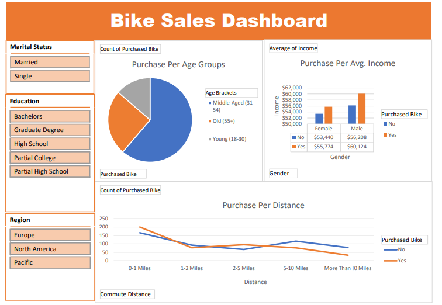

# Bike Sales Dashboard (Excel)

## Project Overview

This project analyzes customer purchasing behavior for bike sales using Microsoft Excel.

The dashboard provides insights into how factors such as age, income, marital status, education, and commute distance influence bike purchases.

---

## Tools Used

- Microsoft Excel
- Pivot Tables
- Pivot Charts
- Slicers
- Conditional Formatting

---

## Dashboard Features

- Interactive filtering using slicers
- Analysis by age group
- Income comparison by gender
- Purchase trends based on commute distance
- Regional and educational segmentation

---

## Key Insights

- Middle-aged customers purchase bikes more frequently.
- Customers with higher average income show greater purchase likelihood.
- Shorter commute distances are associated with higher purchase rates.

---

## Dashboard Preview

---

## Dataset

Dataset used for educational and portfolio purposes.

---

## Skills Demonstrated

- Data Cleaning
- Data Transformation
- Pivot Table Analysis
- Dashboard Design
- Data Visualization